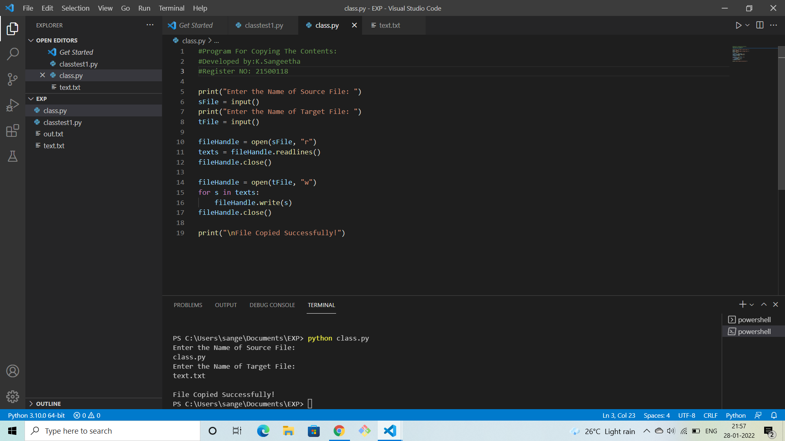
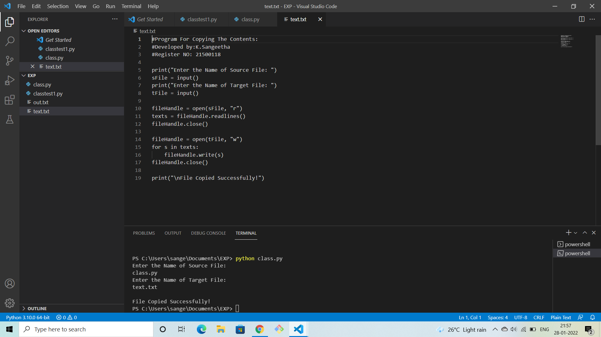

# copy-file

## AIM:
To write a python program for copying the contents from one file to another file.

## EQUIPEMENT'S REQUIRED: 
PC
Anaconda - Python 3.7

## ALGORITHM: 
### Step 1:
First we need to open the required file from which we need to copy the text.
### Step 2: 
 Using keyword "with" to open the required file.
### Step 3: 
Again using the with keyword to open the empty file.
### Step 4:  
The empty file is open by using 'w' which is used to write only.
### Step 5: 
The for function is used to take each line from the main file.
### Step 6: 
write() is used to write the lines of main file to the empty file or to the directed file.

## PROGRAM:
```
#Program For Copying The Contents:
#Developed by:K.Sangeetha
#Register NO: 21500118

print("Enter the Name of Source File: ")
sFile = input()
print("Enter the Name of Target File: ")
tFile = input()

fileHandle = open(sFile, "r")
texts = fileHandle.readlines()
fileHandle.close()

fileHandle = open(tFile, "w")
for s in texts:
    fileHandle.write(s)
fileHandle.close()

print("\nFile Copied Successfully!")
```
## OUTPUT:


## RESULT:
Thus the program is written to copy the contents from one file to another file.